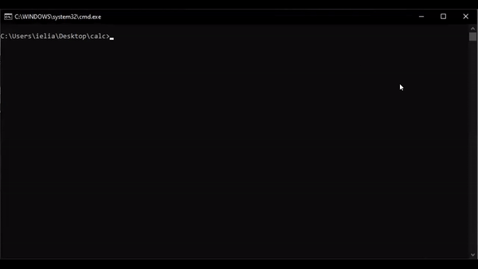
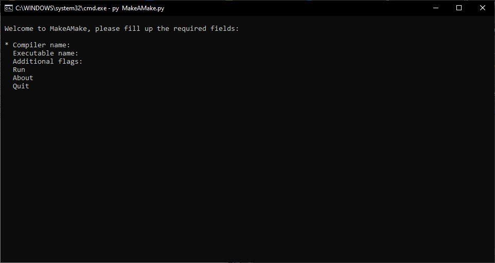
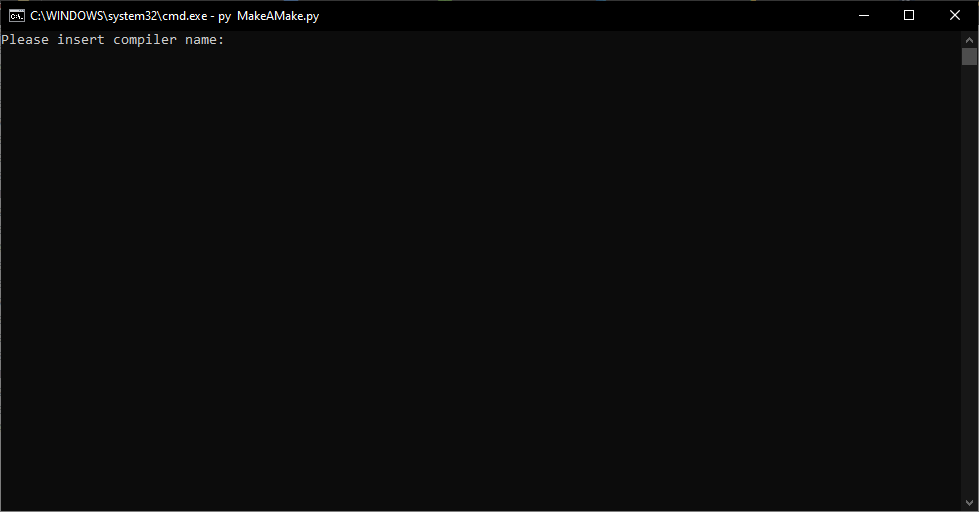
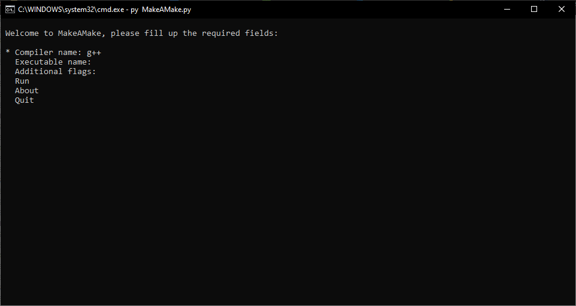
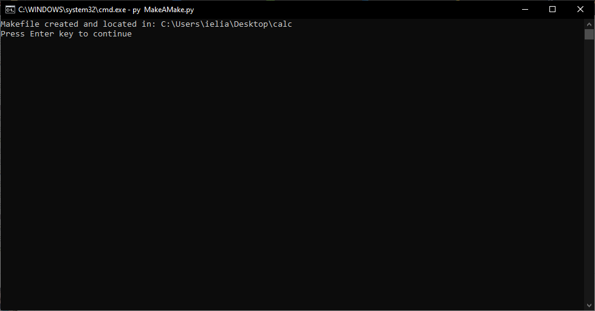

# Make A Make
Feeling lazy writing makefile for your project? Make A Make, a tool to generate a makefile for you.  
<p align="center">
  
</p>

## Getting Started
All you need to do is to install pick library:  
```
pip install pick
```
and then put the MakeAMake.py file in your project and run it, using:  
```python
py MakeAMake.py
```

## Usage
1. First thing you going to see is the main menu:  
<p align="center">
  
</p>

2. Now, using the arrows, select the field you wish to fill, and you will get something like this:
<p align="center">
  
</p>

3. Fill the field and press the Enter key to save it:
<p align="center">
  
</p>

4. When you done filling the required fields, select the Run option:
<p align="center">
  
</p>

And there you go, your makefile is ready 👏

## FAQ
### Why is it called Make A Make?
Well, it is a tool that make a make(file) ☺️

### Do you need a compiler installed?
Yes, you need a compiler installed.  
Make A Make uses the compiler to list the dependencies of your project, and write them to the makefile.

## License
GPL 3.0
